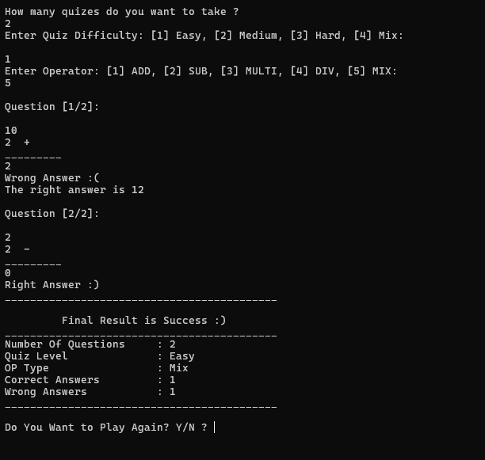

# C++ CLI Math Quiz

A practical exercise in C++ focused on **manual memory safety, input stream handling, and structured logic**. This project was built to explore the differences between high-level managed languages (like TypeScript/Node.js) and lower-level CLI development.

## Overview
A configurable math quiz where the user defines question count, difficulty, and operator types. The program generates problems dynamically and provides a final performance report.

---

## Technical Implementation Notes

Coming from a React/TypeScript background, my focus here was on handling C++ specific constraints that we often take for granted in the browser:

* **Handling `std::cin` Failures:** Unlike JavaScript's `prompt()`, C++ input streams enter a "fail state" if a user inputs a string into an integer variable. I implemented a manual validation layer (`isNumber`) to sanitize inputs and prevent infinite loops—a key lesson in defensive programming.
* **Constant-Driven Design:** I avoided hardcoding logic by using global constants for difficulty ranges and question limits. This makes the "game balance" easily tweakable without refactoring core logic.
* **Data Modeling with Structs:** Used `structs` and `enums` to pass state between functions. This mimics the "Type Safety" I use in TypeScript but within the context of C++ value types.
* **Formatting the CLI:** Since I didn't use an external library like `Chalk` (Node.js), I focused on manual console formatting and tab-calculation to ensure the final report was readable across different terminal sizes.

---

---

## How to Run

This project is part of a monorepo structure. You can open it via the main solution or the project-specific solution.

### 1. The Monorepo Way

Open the root solution file to see all projects in the workspace:
`./root_monorepo.slnx`

### 2. The Project Way

Navigate directly to the project folder:
`projects/06-l2-p2-math-quiz/`

From here, you can open:
`06-l2-p2-math-quiz.slnx`

**Prerequisites:** * A standard C++ compiler (MSVC, GCC, or Clang).
* A terminal or command prompt to run the compiled executable.

---
## Credits
* **Course Material:** This project was developed as part of the C++ curriculum on [ProgrammingAdvices.com](https://programmingadvices.com).
* **Instructor:** Special thanks to Dr. Mohammed Abu-Hadhoud for the structured logic and problem-solving methodologies.