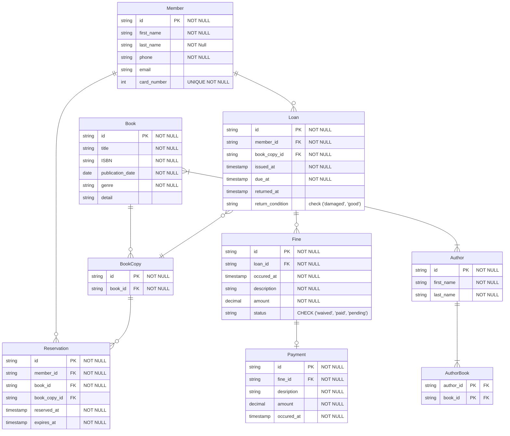

# Database Requirements for a Simple Library

## 1. Book Management
* Store and manage information about books, including title, author(s), ISBN, publication date, genre, and additional details.
* Track availability status of book copies, indicating whether they are available for borrowing or checked out by users.
* Manage multiple copies of a book, each with a unique identifier (copy ID).

## 2. User Management
* Maintain records of library users, including their names, contact information, and library card numbers.

## 3. Borrowing and Returns
* Enable users to borrow book copies from the library.
* Track borrowing records, including the book copy borrowed, user information, borrowing date, and due date.
* Handle the return process, updating the availability status of book copies.
* Check for any fines or penalties associated with late returns or damaged book copies.

## 4. Holds and Reservations
* Allow users to place holds or reservations on book copies that are currently checked out.
* Manage the order of reservations to ensure fairness.

## 5. Fine Management
* Calculate and manage fines or penalties for late returns or damaged book copies.
* Keep track of the fine amount owed by each user.
* Maintain the payment status to track whether fines have been paid or are still pending.

# Solution

## Design Decisions
 
### 1. Book vs BookCopy Split
 
A `Book` represents a conceptual title. A `BookCopy` represents a physical copy of that title. They are split to allow multiple physical copies of the same title to exist independently. Collapsing them into a single `Book` entity would make it impossible to track individual copies, their availability, and their loan history separately.
 
### 2. `Reservation.book_id` not `book_copy_id`
 
A hold is placed against a title, and a specific copy is assigned at fulfillment time. If the reservation were placed against a specific copy, the member would be forced to wait for that exact physical copy even if other copies of the same title were available — which defeats the purpose of a hold queue. `book_copy_id` is nullable on `Reservation` because no copy has been assigned yet at the time of reservation. It is populated when a copy becomes available and is assigned to the next member in the queue.
 
### 3. `Loan → Fine` is One-to-Many
 
A single loan can generate multiple fines — for example, a late return and physical damage are two separate chargeable events with different amounts and different `occurred_at` timestamps. Modeling this as one-to-one would force staff to aggregate all fines into a single entry, which loses the individual amounts, the distinct event timestamps, and the ability to resolve each fine independently.
 
### 4. `BookCopy.status` Removed as a Stored Column
 
Storing `BookCopy.status` explicitly introduces a consistency risk — two sources of truth that can disagree. It was removed because the status is fully derivable from existing data: a `BookCopy` is `checked_out` if it has a `Loan` with a null `returned_at`, `reserved` if it has a `Reservation` with a non-expired `expires_at`, and `available` otherwise. Deriving it on read eliminates the synchronization burden and keeps a single authoritative source of truth.
 
### 5. `AuthorBook` Junction Table with Composite PK
 
`AuthorBook` resolves the many-to-many relationship between `Author` and `Book`. The primary key is a composite of `(author_id, book_id)` rather than a surrogate. A surrogate PK would allow the same author to be credited to the same book in duplicate rows, since uniqueness would only be enforced on the synthetic ID. The composite PK enforces uniqueness of the pair by definition, with no extra constraint needed.
 
### 6. Reservation Ordering by `reserved_at`
 
Ordering reservations by `reserved_at` — first reserved, first served — is simpler and safer than storing an explicit `queue_position` column. A stored position requires the application to maintain a gapless sequence per title, renumbering entries whenever a reservation is added or cancelled, which introduces concurrency risks under simultaneous requests. A `queue_position` column is only justified if staff need the ability to manually reorder the queue, in which case the application must own and maintain the integrity of that sequence transactionally.