# Karate Club — Relational Schema Design

This exercise is part of the [Engineering Logic Roadmap](https://github.com/yousdevs/Engineering-Logic-Roadmap).

The goal is to design a normalized relational schema for a karate club management system from a set of domain requirements, applying sound database design principles (database-first approach).

---

## Requirements

### 1. Membership Management

- The system should allow the creation and management of member profiles, including personal information, contact details, emergency contact information, and membership status.
- Member information: Name, Address, ContactInfo, Emergency Contact.
- Each member can have subscription periods and each period should have StartDate, EndDate, Fees, and IsPaid.
- Members should be able to enroll in the karate club, renew their memberships, and update their information as needed.
- The system should track membership start and end dates, as well as membership status (active/inactive).

### 2. Instructor Management

- The system should allow the creation and management of instructor profiles, including personal information and qualifications.
- Instructor information: Name, Address, ContactInfo, Qualifications.
- Members can have many instructors.
- Multiple instructors should be able to train a single member, and each instructor should be able to train multiple members.

### 3. Belt Rank and Testing

- The system should support the management of different belt rank tests in karate.
- Members should be able to participate in belt rank tests to advance their ranks.
- The system should track belt test dates, results, and the instructors who conducted the tests.
- Each member's current belt rank should be recorded and updated as they pass tests and progress.
- Belt ranks are fixed in the system: White Belt, Yellow Belt, Orange Belt, Green Belt, Blue Belt, Purple Belt, Brown Belt, Black Belt (1st–10th Dan).
- Each belt rank has a different test fee.

### 4. Payment and Fee Management

- The system should support the management of membership fees and payments as well as test fee payments.
- Members should be able to view their payment history and make payments for membership fees.
- The system should track payment details such as the amount, date, and payment status.
- Members can pay for subscriptions and for tests.

---

## ERD Solution

```mermaid
erDiagram
direction TB
Person{
    string id PK "NOT NULL"
    string first_name "NOT NULL"
    string last_name "NOT NULL"
    date date_of_birth "NOT NULL"
}
Account{
    string id PK "NOT NULL"
    string person_id FK "NOT NULL"
    timestamp registered_at "NOT NULL"
    timestamp deleted_at
    timestamp freezed_at
}
AccountCredential{
    string account_id PK "FK"
    string email_id FK "NOT NULL"
    string password_hash "NOT NULL"
    timestamp last_login_at 
    timestamp email_verified_at
}
Manager{
    string id PK "NOT NULL"
    string account_id FK "NOT NULL"
}
Member{
    string id PK "NOT NULL"
    string account_id FK "NOT NULL"
    string current_rank_id FK
}
Instructor{
    string id PK "NOT NULL"
    string account_id FK "NOT NULL"
    string qualification "NOT NULL"
}
MemberInstructor {
    string member_id PK "FK"
    string instructor_id PK "FK"
    timestamp assigned_at "NOT NULL"
    timestamp unassigned_at
}
Subscription{
    string id PK "NOT NULL"
    string subscription_tier_id FK "NOT NULL"
    string member_id FK "NOT NULL"
    decimal fee_at_enrollment "NOT NULL"
}
SubscriptionPeriod{
    string id PK "NOT NULL"
    string subscription_id FK "NOT NULL"
    timestamp enrolled_at "NOT NULL"
    timestamp expires_at "NOT NULL"
    timestamp cancelled_at
    string status "CHECK('active', 'expired', 'cancelled')"
}
SubscriptionTier{
    string id PK "NOT NULL"
    string name "NOT NULL"
    decimal fee "NOT NULL"
    timestamp created_at "NOT NULL"
    string created_by FK "NOT NULL"
    timestamp updated_at 
    string updated_by FK
    timestamp deleted_at
    string deleted_by FK
}
TestSchedule{
    string id PK "NOT NULL"
    timestamp created_at "NOT NULL"
    string rank_id FK "NOT NULL"
    timestamp scheduled_at "NOT NULL"
    timestamp conducted_at
    string status "CHECK('scheduled','conducted','cancelled')"
}
TestAttendance{
    string id PK "NOT NULL"
    string test_schedule_id FK "NOT NULL"
    string member_id FK "NOT NULL"
    timestamp attended_at
    timestamp registered_at "NOT NULL"
    string status "CHECK('registered','attended','absent')"
    string notes 
 }
 TestOutcome{
    string id PK "NOT NULL"
    string test_attendance_id FK "NOT NULL"
    string result "CHECK('passed', 'failed')"
    timestamp created_at "NOT NULL"  
 }
Rank{
    string id PK "NOT NULL"
    string name "NOT NULL"
    int rank_order "NOT NULL"
    decimal fee "NOT NULL"
    timestamp created_at "NOT NULL"
    string created_by FK "NOT NULL"
    timestamp updated_at 
    string updated_by FK
    timestamp deleted_at
    string deleted_by FK
}
MemberRankHistory {
     string id PK
     string member_id FK "NOT NULL"
     string rank_id FK "NOT NULL"
     timestamp achieved_at "NOT NULL"
     string test_outcome_id FK
}
InstructorTestSchedule{
    string test_schedule_id PK "FK"
    string instructor_id PK "FK"
}

Invoice{
    string id PK "NOT NULL"
    string member_id FK "NOT NULL"
    decimal amount "NOT NULL"
    string status "CHECK ('draft', 'issued', 'paid', 'void')"
    timestamp issued_at "NOT NULL"
    timestamp due_at "NOT NULL"
}
InvoiceLineItem{
    string id PK "NOT NULL"
    string invoice_id FK "NOT NULL"
    string description
    int quantity "NOT NULL"
    decimal unit_price "NOT NULL"
    decimal total "NOT NULL"
    string payable_type "CHECK ('subscription','test_attendance')"
    string payable_id "NOT NULL"
}
Payment{
    string id PK "NOT NULL"
    decimal amount "NOT NULL"
    string method "NOT NULL"
    timestamp paid_at "NOT NULL"
}
InvoicePayment{
    string invoice_id PK "FK"
    string payment_id PK "FK"
    decimal amount_applied "NOT NULL"
}

Email{
    string id PK "NOT NULL"
    string account_id FK "NOT NULL"
    string email_type "CHECK ('personal', 'work')"
    string email "NOT NULL"
    bool is_primary "NOT NULL"
    bool is_verified "NOT NULL"
}
Phone{
    string id PK "NOT NULL"
    string account_id FK "NOT NULL"
    string phone_type "CHECK ('personal', 'work')"
    string phone "NOT NULL"
    bool is_primary "NOT NULL"
    bool is_verified "NOT NULL"
}
Address{
    string id PK "NOT NULL"
    string account_id FK "NOT NULL"
    string address_type "CHECK ('home', 'work')"
    string line_1 "NOT NULL"
    string line_2 
    string city "NOT NULL"
    string postal_code "NOT NULL"
    string country "NOT NULL"
    bool is_primary "NOT NULL"
}
EmergencyContact{
    string id PK "NOT NULL"
    string member_id FK "NOT NULL"
    string full_name "NOT NULL"
    string phone_number "NOT NULL"
    string email
    string address
}

Account ||--|| Person : ""
Account ||--o{ Email : ""
Account || --o{ Phone : ""
Account ||--o{ Address : ""
Account ||--o| AccountCredential : ""
Email ||--o| AccountCredential : ""
Manager |o--|| Account : ""
Member |o--|| Account : ""
Instructor |o--|| Account : ""
Member ||--o{ EmergencyContact : ""
MemberInstructor }o--|| Member : ""
MemberInstructor }o--|| Instructor : ""

Manager ||--o{ SubscriptionTier : "created_by / updated_by / deleted_by"
Manager ||--o{ Rank : "created_by / updated_by / deleted_by"

SubscriptionTier ||--o{ Subscription : ""
Member ||--o{ Subscription : ""
Subscription ||--o{ SubscriptionPeriod : ""

Rank ||--o{ TestSchedule : ""
Instructor ||--o{ InstructorTestSchedule : ""
InstructorTestSchedule |o--|| TestSchedule : ""
TestAttendance }o--|| TestSchedule : ""
Member ||--o{ TestAttendance : ""
TestAttendance ||--o| TestOutcome : ""
MemberRankHistory }o--|| Member : ""
MemberRankHistory }o--|| Rank : ""
MemberRankHistory }o--o| TestOutcome : ""

InvoicePayment |o--|| Payment : ""
InvoicePayment |o--|| Invoice : ""
Invoice ||--o{ InvoiceLineItem : ""
Member ||--o{ Invoice : ""

```

---

## Design Decisions
 
### Person / Account / Role Separation
 
`Person` represents a human being and carries generic biographical information — name, date of birth. `Account` is the system identity and authentication anchor — it owns the contact information (`Email`, `Phone`, `Address`) and carries the lifecycle timestamps (`registered_at`, `deleted_at`, `freezed_at`). `Member`, `Instructor`, and `Manager` are domain entities that carry role-specific data. `Person` exists as a separate table so that personal information is never duplicated — if someone is both a member and an instructor, they have one `Person` row, one `Account`, and two role rows, with a single source of truth for their biographical data.
 
### `AccountCredential` References `Email` FK, Not a Raw String
 
The login credential references `Email.id` as a foreign key rather than storing an email string directly. This ties the credential to a verified, structured contact record — `Email.is_verified` directly reflects whether the login email has been confirmed, with no need for a separate verification flag on the credential itself. It also preserves email history: if a member changes their login email, a new row is added to `Email` and `AccountCredential.email_id` is updated to point to it. The old email row remains in the contact history. Storing a raw string would lose this history and bypass the verification model entirely.
 
### `Subscription` vs `SubscriptionPeriod` Split
 
`Subscription` represents the ongoing relationship between a member and a tier — the fact that this member is subscribed to this plan. `SubscriptionPeriod` represents a single billing cycle within that relationship — a specific start date and end date. When a member renews, a new `SubscriptionPeriod` row is created on the existing `Subscription`. No new `Subscription` row is created. This preserves the full renewal history on a single subscription record and avoids fragmenting a member's continuous club relationship across multiple disconnected rows.
 
### `fee_at_enrollment` on `Subscription`
 
`fee_at_enrollment` is a snapshot of the tier fee taken at the moment the member first enrolled in this subscription. If the application reads `SubscriptionTier.fee` at query time instead, any change to the tier fee retroactively alters what the member appears to have been charged — which corrupts billing history, breaks payment reconciliation, and makes any audit of historical revenue impossible. The snapshot is populated once at enrollment and never updated.
 
### `TestSchedule → TestAttendance → TestOutcome` Three-Table Lifecycle
 
These are three distinct domain events with different actors and different timestamps. A test session is scheduled by an instructor (`TestSchedule`). A member registers for that session (`TestAttendance`). The result of the member's performance is recorded after the session is conducted (`TestOutcome`). Collapsing them into a single `Test` table would produce a large number of nullable columns, and make state management across the test lifecycle nearly impossible — it would be unclear which columns are valid at which stage, and enforcing transitions between states would require application-level checks that the schema cannot support.
 
### `MemberInstructor` as a Standing Relationship
 
`InstructorTestSchedule` links instructors to test sessions — it answers which instructors supervised a given test. It cannot answer who are the instructors currently assigned to train a given member, because training assignments exist independently of test events. A member may train with an instructor for months before sitting any test. `MemberInstructor` models this standing assignment with `assigned_at` and `unassigned_at` timestamps, allowing the full assignment history to be queried without touching the test history at all.
 
### `current_rank_id` Nullable on `Member`
 
A null `current_rank_id` means the member has not yet sat any belt test and holds no rank. This is distinct from holding a white belt, which means the member sat the white belt test and passed it — a domain achievement recorded in `TestOutcome`. Defaulting new members to white belt at registration would imply a test occurred when none did, corrupting the test history and making it impossible to distinguish members who have been graded from members who have simply enrolled.
 
### `Invoice.amount` Alongside `InvoiceLineItem.total`
 
`Invoice.amount` and the sum of `InvoiceLineItem.total` represent the same value. Storing both is a deliberate denormalization. Omitting `Invoice.amount` and deriving the total from line items requires a JOIN and GROUP BY on every invoice read — on a billing dashboard displaying totals for hundreds of members, this becomes a significant performance concern. `Invoice.amount` is a sealed snapshot of the line item sum taken when the invoice transitions from `draft` to `issued`. After that point it is immutable. The application is responsible for updating both `InvoiceLineItem.total` and `Invoice.amount` within the same database transaction whenever line items are modified during the draft stage.
 
### Polymorphic Reference on `InvoiceLineItem`
 
`InvoiceLineItem.payable_type` and `payable_id` reference either a `SubscriptionPeriod` or a `TestAttendance` without a real FK constraint — the database cannot verify that the `payable_id` corresponds to a real row of the declared type. This is a known tradeoff made in favor of flexibility: a single invoice can have line items referencing multiple payable sources simultaneously — for example, a subscription renewal and a belt test fee in one billing run. Typed junction tables would enforce referential integrity at the database level but would require a separate invoice per payable type, which is operationally inconvenient. As a result of this tradeoff, the application layer is responsible for validating that every `payable_id` corresponds to a real row of the declared `payable_type` before any line item is inserted.
 
### `EmergencyContact.address` as a Plain String
 
The `Address` table uses a fully structured model with separate columns for line 1, city, postal code, and country. `EmergencyContact.address` is an unstructured plain string. This is a deliberate simplification — an emergency contact is a person the club needs to reach by phone in an urgent situation. A name and phone number is sufficient for that purpose. The club will never mail the emergency contact, validate their postal code, or query by city. Applying the full structured address model would add four nullable columns with no operational benefit and would complicate the emergency contact form without any practical return.